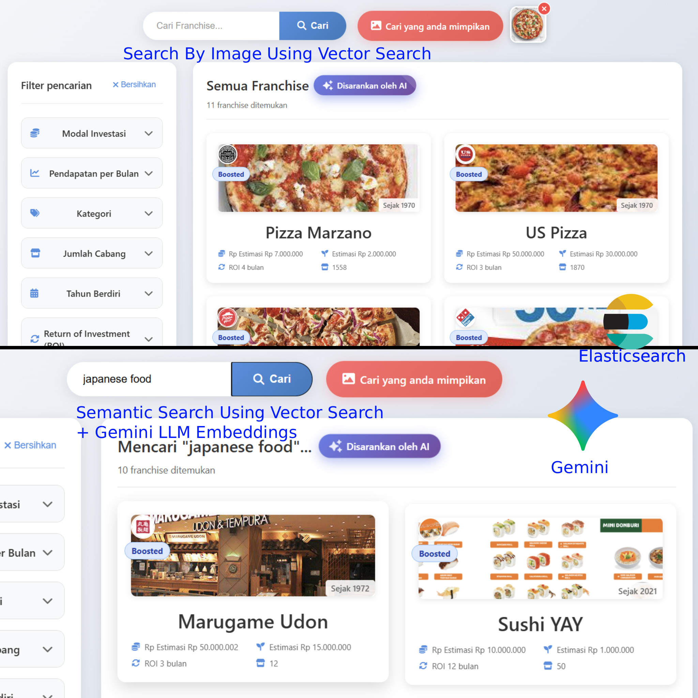
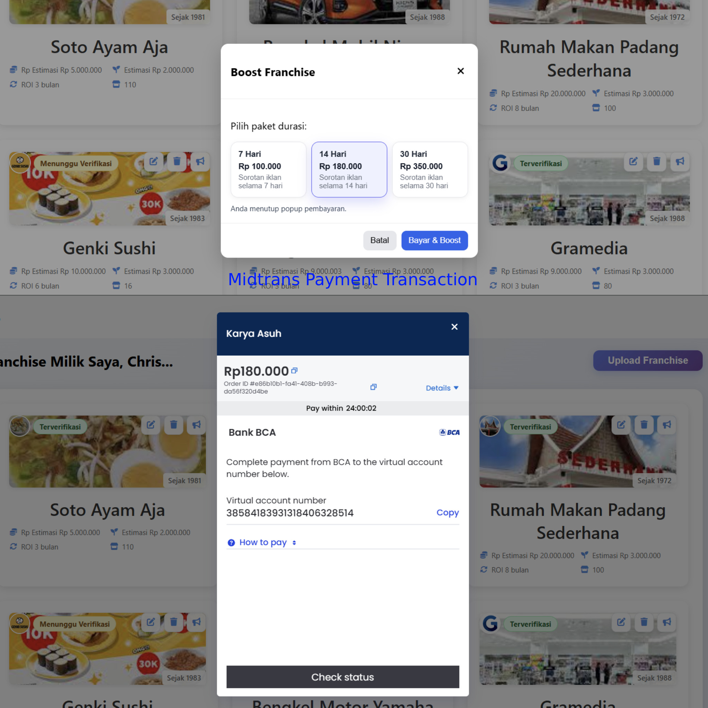
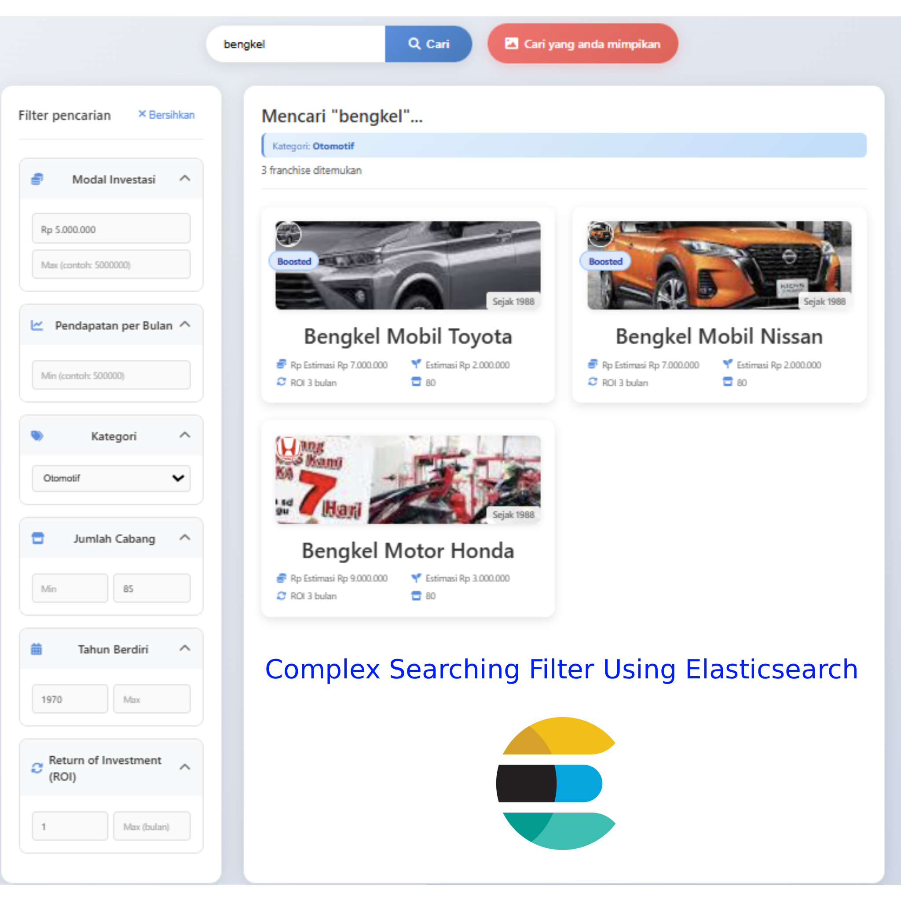
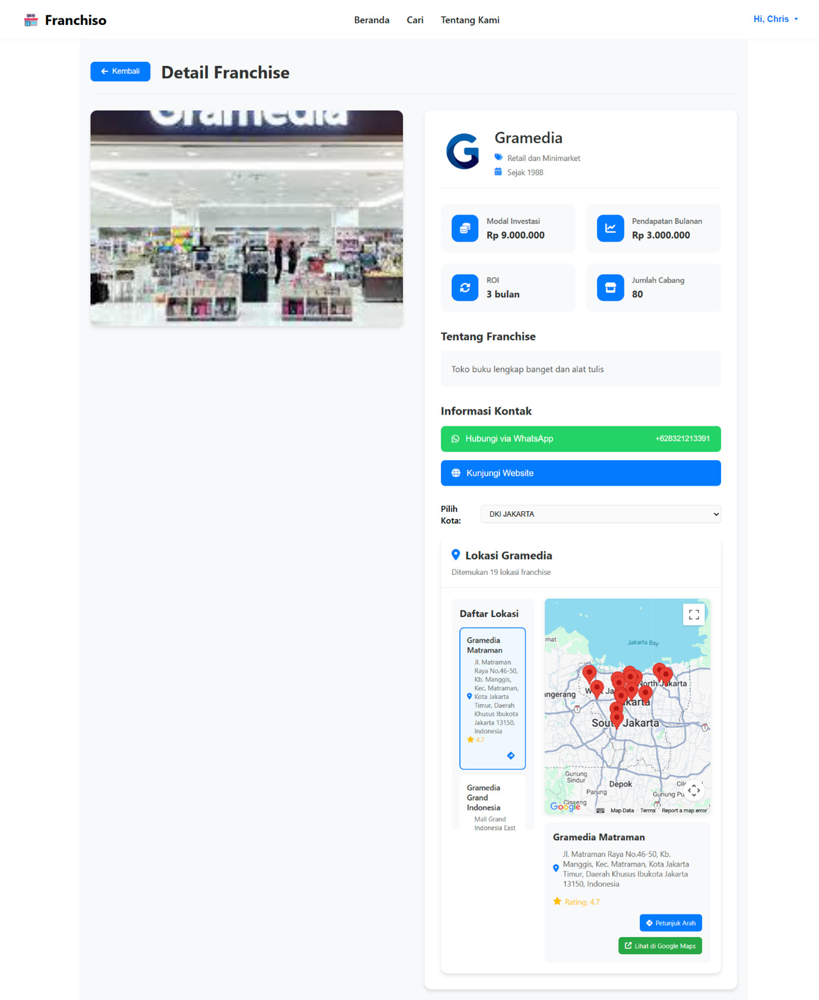

# Franchiso
Franchiso is a web-based marketplace platform designed to facilitate the buying and selling of franchise businesses in Indonesia by connecting franchisors and potential franchisees in a single digital ecosystem. The platform allows franchisors to publish detailed franchise information, including investment costs, return on investment, business documents, and outlet locations, while enabling franchisees to search and compare opportunities using advanced filters and location mapping features. By incorporating business verification, structured information, and secure transaction support, Franchiso aims to increase transparency, trust, and efficiency in the franchise trading process, making it easier for users to find, evaluate, and acquire franchise business opportunities.

## AI & Search Features

<table border="0">
  <tr>
    <td valign="top" width="50%">
      <b>Searching Using AI</b><br>
      <br>
      Advanced search system leveraging AI to search by query and image.
    </td>
    <td valign="top" width="50%">
      <b>Midtrans Payments</b><br>
      <br>
      Seamless and secure boosting payment transactions.
    </td>
  </tr>
  <tr>
    <td valign="top" width="50%">
      <b>Elasticsearch Filters</b><br>
      <br>
      Combines traditional filters with AI semantic similarity.
    </td>
    <td valign="top" width="50%">
      <b>Location Mapping</b><br>
      <br>
      Geospatial data visualization for franchise outlets.
    </td>
  </tr>
</table>

## Franchiso Frontend 2

Franchiso Frontend 2 is a React-based single-page application built with `create-react-app`, `react-router-dom`, and `@reduxjs/toolkit`. It provides the user-facing interface for browsing, searching, and managing franchise listings, as well as dashboards for franchisors and administrators.

For the backend code repository, please clone from https://github.com/chrisprojs/franchiso-backend-2

### Tech Stack

- **Framework**: React (JavaScript)
- **State Management**: Redux Toolkit + `react-redux`, `redux-persist`

### Getting Started

1. **Install dependencies**

   ```bash
   npm install
   ```

2. **Configure environment variables**

   - Copy `env.example` to `.env` (if not already present).
   - Fill in the required values such as API base URLs, authentication keys, and optional map/search configuration.

3. **Run the development server**

   ```bash
   npm start
   ```

   The app will be available at `http://localhost:3000`.

### Project Structure (Frontend)

- **`src/App.js`**: Main application shell and route definitions.
- **`src/store.js`**: Redux store configuration and persistence setup.
- **`src/api/`**:
  - `AuthAPI.js`: Authentication-related API calls (login, register, profile).
  - `FranchiseAPI.js`: Franchise listing, detail, and management API calls.
- **`src/page/`**: Top-level pages:
  - `Home.js`: Landing page with featured franchises and search entry points.
  - `Search.js`: Franchise search with filters and (optionally) AI-powered features.
  - `FranchiseDetail.js`: Detailed franchise information, documents, and outlet locations.
  - `UploadFranchise.js`: Form for franchisors to submit new franchise listings.
  - `FranchisorDashboard.js`: Franchisor view for managing their franchises and boosts.
  - `AdminDashboard.js`: Admin overview of platform activity and verifications.
  - `FranchiseVerificationDetail.js` / `AdminFranchiseVerificationDetail.js`: Detailed verification flows for submitted franchises.
  - `Login.js`, `Register.js`, `Profile.js`, `AboutUs.js`: Authentication and informational pages.
- **`src/component/`**: Reusable UI components:
  - `Navbar.js`: Application navigation bar.
  - `FranchiseCard.js`: Card representation of franchise items in lists.
  - `FranchiseMap.js`: Map visualization of franchise outlet locations.
  - `BoostModal.js`: Modal for boosting/promoting franchise listings.
  - `AuthForm.js`, `AuthImage.js`: Auth-related layout components.
- **`src/data/ListFranchiseMap.jsx`**: Static or helper data for map-based franchise rendering.
- **`indonesia-province-simple.json`**: Location data used for mapping and filters in Indonesia.

### Maps & Geospatial Features

Franchiso Frontend 2 supports geospatial visualization of franchise outlets and province-based filtering. For details on how to configure map providers, API keys, and coordinate data, see `MAP_SETUP.md`. The `FranchiseMap` component consumes map configuration and outlet location data to render interactive maps inside detail and search pages.

### AI Search, Filters & Payments (Frontend Role)

The frontend integrates with backend services that provide:

- **AI-powered search**: Sending text/image queries to backend AI search endpoints and rendering ranked franchise results.
- **Elasticsearch filters**: Building filter queries (investment, category, location, ROI, etc.) and visualizing results using traditional and semantic similarity search.
- **Midtrans payments**: Initiating and tracking boosting/payment flows via Midtrans through API calls and callback handling.

This repository focuses on the UI and client-side behavior; the core AI, search indexing, and payment integrations are implemented on the backend and exposed via the APIs consumed in `src/api/`.
